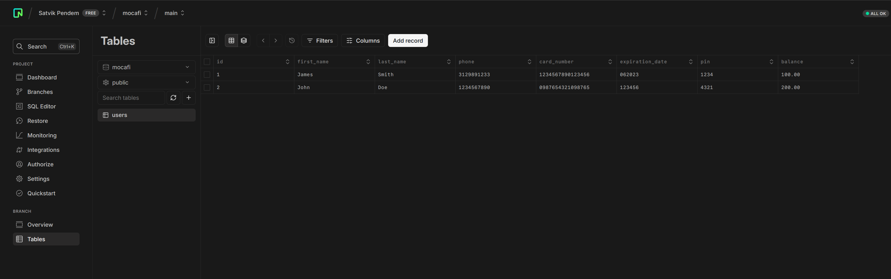

# Mocafi

## Information

This is a [Next.js](https://nextjs.org/) project that runs on the serverside and uses the latest features of Next.js 15 and React 19, such as React Server Components and server actions that enable you to seamlessly integrate backend code into the frontend without having to manually set up and write API routes.
The database on the backend is powered by [Neon](https://neon.tech/). The frontend will call the Neon database once an account number is entered and then return the balance. If the account number is not found, the frontend will return a message saying that the account number was not found. The database has the following schema, all in one table called `users`, as well as example data:

## Usage

The URL is at <https://mocafi-1xgqo0b12-satvik-pendems-projects.vercel.app/>. You can use the following numbers to test out the app:

- 1234567890123456
- 0987654321098765
